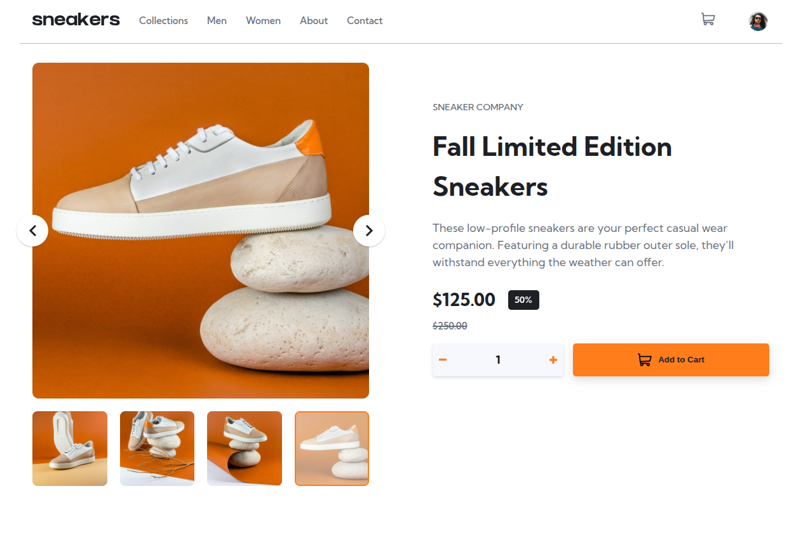

# Frontend Mentor - E-commerce product page solution

This is a solution to the [E-commerce product page challenge on Frontend Mentor](https://www.frontendmentor.io/challenges/ecommerce-product-page-UPsZ9MJp6). Frontend Mentor challenges help you improve your coding skills by building realistic projects.

## Table of contents

- [Overview](#overview)
  - [The challenge](#the-challenge)
  - [Screenshot](#screenshot)
  - [Links](#links)
- [My process](#my-process)
  - [Built with](#built-with)
  - [What I learned](#what-i-learned)
  - [Continued development](#continued-development)
  - [Useful resources](#useful-resources)
- [Author](#author)
- [Acknowledgments](#acknowledgments)

**Note: Delete this note and update the table of contents based on what sections you keep.**

## Overview

### The challenge

Users should be able to:

- View the optimal layout for the site depending on their device's screen size
- See hover states for all interactive elements on the page
- Open a lightbox gallery by clicking on the large product image
- Switch the large product image by clicking on the small thumbnail images
- Add items to the cart
- View the cart and remove items from it

### Screenshot



Add a screenshot of your solution. The easiest way to do this is to use Firefox to view your project, right-click the page and select "Take a Screenshot". You can choose either a full-height screenshot or a cropped one based on how long the page is. If it's very long, it might be best to crop it.

Alternatively, you can use a tool like [FireShot](https://getfireshot.com/) to take the screenshot. FireShot has a free option, so you don't need to purchase it.

Then crop/optimize/edit your image however you like, add it to your project, and update the file path in the image above.

### Links

- Solution URL: [here is a link to the github repo](https://github.com/Drslope-99/ecommerce-product-page-main)
- Live Site URL: [here is a link to the live site](https://ecommerce-product-page-main-jet-ten.vercel.app/)

## My process

### Built with

- Semantic HTML5 markup
- CSS custom properties
- Flexbox
- CSS Grid
- Mobile-first workflow
- [React](https://reactjs.org/) - JS library
- [Vite](https://vite.dev/) - React framework

**Note: These are just examples. Delete this note and replace the list above with your own choices**

### What I learned

learnt the fundamental building blocks of state management with react and how to compose clean and reuseable components.

To see how you can add code snippets, see below:

```html
<h1>Some HTML code I'm proud of</h1>
```

```css
.proud-of-this-css {
  color: papayawhip;
}
```

```js
const proudOfThisFunc = () => {
  console.log("🎉");
};
```

If you want more help with writing markdown, we'd recommend checking out [The Markdown Guide](https://www.markdownguide.org/) to learn more.

**Note: Delete this note and the content within this section and replace with your own learnings.**

### Continued development

in the future,ill be focusing more on advanced state management using the useReducer and other state management libraries like redux and zustand as well as other react hooks such as useMemo and the rest

### Useful resources

- [Example resource 1](https://www.example.com) - This helped me for XYZ reason. I really liked this pattern and will use it going forward.
- [Example resource 2](https://www.example.com) - This is an amazing article which helped me finally understand XYZ. I'd recommend it to anyone still learning this concept.

## Author

- Website - [Add your name here](https://www.your-site.com)
- Frontend Mentor - [@Drslope-99](https://www.frontendmentor.io/profile/Drslope-99)
- Twitter - [@ukangaofficial](https://x.com/ukangaofficial?t=qlkINpYpouPxXZZ61RKXhw&s=09)

## Acknowledgments

a shout out to my one and only mentor Jonas Shmedtmann who has been a wonderful inspiration to my on my react and javascript journey, without him i dont think i would have become a confident reactj developer and also to my brother Ekomabasi Martin for always pushing me beyond my limits
